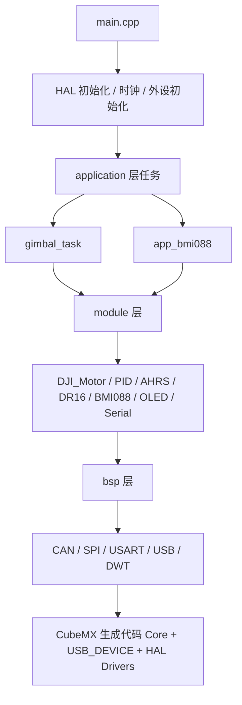

# STM32_GIMBAL_Projects

基于 STM32F405 + HAL + CubeMX + CMake 的云台控制学习/开发工程。

## 程序函数调用框图



## 项目目录结构（按当前仓库）

```text
.
├─ Core/                     # CubeMX 生成：核心启动与外设初始化
├─ Drivers/                  # HAL/CMSIS
├─ Middlewares/              # USB Device 等中间件
├─ USB_DEVICE/               # USB 设备栈与接口
├─ cmake/
│  └─ stm32cubemx/           # CubeMX 转换后的 CMake 子工程
├─ Usercode/
│  ├─ 1_bsp/                 # 板级支持层
│  │  ├─ CAN/
│  │  ├─ DWT/
│  │  ├─ SPI/
│  │  ├─ USART/
│  │  └─ USB/
│  ├─ 2_module/              # 功能模块层
│  │  ├─ bmi088/
│  │  ├─ DJI_Motor/
│  │  ├─ DR16/
│  │  ├─ Math/
│  │  ├─ OLED/
│  │  └─ Serial/
│  └─ 3_application/         # 业务应用层
│     ├─ bmi088/
│     └─ gimbal_task/
├─ CMakeLists.txt
├─ CMakePresets.json
├─ GeneratorBefore.bat
└─ GeneratorAfter.bat
```

## 分层使用逻辑

1. `Core/`、`USB_DEVICE/`、`Drivers/`、`Middlewares/`：CubeMX/HAL 生成与维护。
2. `Usercode/1_bsp`：直接贴近硬件外设（CAN/SPI/UART/USB/DWT 等）。
3. `Usercode/2_module`：可复用功能模块（电机、传感器、算法、通信组件）。
4. `Usercode/3_application`：任务编排与业务逻辑，组合调用 module + bsp。
5. 顶层 `CMakeLists.txt`：统一组织 `stm32cubemx + bsp + module + application`。

## 开发流程（建议）

1. 基于 `main` 创建功能分支。
2. 在分支上开发 `Usercode` 下的 `.c/.cpp/.h`。
3. 若需改外设，打开 `.ioc` 用 CubeMX 配置并重新生成。
4. 提交并推送分支。
5. 回到 `main` 后，仅按需提取模块文件：

```bash
git checkout <你的功能分支> -- Usercode/
```

6. 在 `main` 提交合并后的模块更新。

## CubeMX + C++ 协同策略

CubeMX 会固定生成 `main.c`（以及 USB CDC 的 `usbd_cdc_if.c`），而工程实际使用 `main.cpp` / `usbd_cdc_if.cpp`。

当前方案：

1. 生成前执行 `GeneratorBefore.bat`：把 `main.cpp` 临时改名为 `main.c`。
2. CubeMX 完成生成后执行 `GeneratorAfter.bat`：再改回 `main.cpp`，并删除 `usbd_cdc_if.c`。
3. 顶层 `CMakeLists.txt` 中把 `main.c`、`usbd_cdc_if.c` 标为 `HEADER_FILE_ONLY`，并显式编译 `main.cpp`、`usbd_cdc_if.cpp`。

## CMake 构建

```bash
cmake --preset Debug
cmake --build --preset Debug
```

Release 构建：

```bash
cmake --preset Release
cmake --build --preset Release
```

## 关键脚本与配置（完整原文）

### `GeneratorBefore.bat`

```bat
@echo off
echo =============^> GeneratorBefore.bat run ^<=============

set "main_c_file=%~dp0Core\Src\main.c"
set "main_cpp_file=%~dp0Core\Src\main.cpp"

echo main_c_file  = "%main_c_file%"
echo main_cpp_file= "%main_cpp_file%"

if exist "%main_cpp_file%" (
    REM If a stale main.c exists, remove it to avoid rename failure
    if exist "%main_c_file%" (
        echo Found existing main.c, deleting it...
        del /f /q "%main_c_file%"
        if errorlevel 1 (
            echo [ERR] Failed to delete main.c
            exit /b 11
        )
        echo Deleted main.c OK
    )

    echo Found main.cpp
    ren "%main_cpp_file%" main.c
    if errorlevel 1 (
        echo [ERR] Rename failed: main.cpp to main.c
        exit /b 12
    )
    echo Rename OK: main.cpp to main.c
) else (
    echo [ERR] main.cpp not found
    exit /b 10
)

echo =============^> GeneratorBefore.bat stop ^<=============
```

### `GeneratorAfter.bat`

```bat
@echo off
echo ============= GeneratorAfter.bat run =============

set "main_c_file=%~dp0Core\Src\main.c"
set "main_cpp_file=%~dp0Core\Src\main.cpp"

if exist "%main_c_file%" (
    if exist "%main_cpp_file%" (
        echo [ERR] main.cpp already exists, abort.
        exit /b 20
    )
    ren "%main_c_file%" main.cpp
    if errorlevel 1 (
        echo [ERR] Rename failed.
        exit /b 21
    )
    echo OK renamed main.c to main.cpp
) else (
    echo [ERR] main.c not found
    exit /b 30
)

set "usb_c_file=%~dp0USB_DEVICE\App\usbd_cdc_if.c"
if exist "%usb_c_file%" (
    del /f /q "%usb_c_file%"
    if errorlevel 1 (
        echo [ERR] Delete usbd_cdc_if.c failed.
        exit /b 31
    )
    echo OK deleted usbd_cdc_if.c
) else (
    echo [WARN] usbd_cdc_if.c not found, skip delete
)

echo ============= GeneratorAfter.bat stop =============
```

### `CMakeLists.txt`（仓库根目录）

```cmake
cmake_minimum_required(VERSION 3.22)

#
# This file is generated only once,
# and is not re-generated if converter is called multiple times.
#
# User is free to modify the file as much as necessary
#

# Setup compiler settings
set(CMAKE_C_STANDARD 11)
set(CMAKE_C_STANDARD_REQUIRED ON)
set(CMAKE_C_EXTENSIONS ON)

# >>> C++ settings (ADD)
set(CMAKE_CXX_STANDARD 17)
set(CMAKE_CXX_STANDARD_REQUIRED ON)
# <<<

# Define the build type
if(NOT CMAKE_BUILD_TYPE)
    set(CMAKE_BUILD_TYPE "Debug")
endif()

# Set the project name
set(CMAKE_PROJECT_NAME F405RGT6Project)

# Enable compile command to ease indexing with e.g. clangd
set(CMAKE_EXPORT_COMPILE_COMMANDS TRUE)

# Core project settings
# >>> REPLACE: enable CXX here
project(${CMAKE_PROJECT_NAME} LANGUAGES C CXX ASM)
# <<<
message("Build type: " ${CMAKE_BUILD_TYPE})

# Enable CMake support for ASM and C languages
enable_language(C ASM)

# Create an executable object type
add_executable(${CMAKE_PROJECT_NAME})

# ---------------------------------------------------------------------------
# Keep only main.cpp: ignore CubeMX-referenced main.c (may not exist)
# MUST be placed before add_subdirectory(cmake/stm32cubemx)
set(MX_MAIN_C ${CMAKE_SOURCE_DIR}/Core/Src/main.c)
set_source_files_properties(${MX_MAIN_C} PROPERTIES
    GENERATED TRUE
    HEADER_FILE_ONLY TRUE
)

# Keep only usbd_cdc_if.cpp: ignore CubeMX-referenced usbd_cdc_if.c
# MUST be placed before add_subdirectory(cmake/stm32cubemx)
set(MX_USBD_CDC_IF_C ${CMAKE_SOURCE_DIR}/USB_DEVICE/App/usbd_cdc_if.c)
set_source_files_properties(${MX_USBD_CDC_IF_C} PROPERTIES
    GENERATED TRUE
    HEADER_FILE_ONLY TRUE
)
# ---------------------------------------------------------------------------

# Add STM32CubeMX generated sources
add_subdirectory(cmake/stm32cubemx)

# ---------------------------------------------------------------------------
# Global include collection to allow: #include "can.h" anywhere
# It will add every directory that contains headers under bsp/module/application
# ---------------------------------------------------------------------------
function(collect_header_dirs out_var base_dir)
    file(GLOB_RECURSE _hdrs CONFIGURE_DEPENDS
        ${base_dir}/*.h
        ${base_dir}/*.hpp
        ${base_dir}/*.hh
        ${base_dir}/*.hxx
    )
    set(_dirs "")
    foreach(_h ${_hdrs})
        get_filename_component(_d "${_h}" DIRECTORY)
        list(APPEND _dirs "${_d}")
    endforeach()
    list(REMOVE_DUPLICATES _dirs)
    set(${out_var} ${_dirs} PARENT_SCOPE)
endfunction()

add_library(project_includes INTERFACE)

collect_header_dirs(BSP_HDR_DIRS  "${CMAKE_SOURCE_DIR}/Usercode//1_bsp")
collect_header_dirs(MOD_HDR_DIRS  "${CMAKE_SOURCE_DIR}/Usercode//2_module")
collect_header_dirs(APP_HDR_DIRS  "${CMAKE_SOURCE_DIR}/Usercode//3_application")

target_include_directories(project_includes INTERFACE
    ${BSP_HDR_DIRS}
    ${MOD_HDR_DIRS}
    ${APP_HDR_DIRS}
)
# ---------------------------------------------------------------------------

# Add layered libraries
add_subdirectory(Usercode/1_bsp)
add_subdirectory(Usercode/2_module)
add_subdirectory(Usercode/3_application)

# Link directories setup
target_link_directories(${CMAKE_PROJECT_NAME} PRIVATE
    # Add user defined library search paths
)

# Add sources to executable
target_sources(${CMAKE_PROJECT_NAME} PRIVATE
    ${CMAKE_SOURCE_DIR}/Core/Src/main.cpp
    ${CMAKE_SOURCE_DIR}/USB_DEVICE/App/usbd_cdc_if.cpp
)

# Add include paths
target_include_directories(${CMAKE_PROJECT_NAME} PRIVATE
    # Add user defined include paths
)

# Add project symbols (macros)
target_compile_definitions(${CMAKE_PROJECT_NAME} PRIVATE
    # Add user defined symbols
)

# Remove wrong libob.a library dependency when using cpp files
list(REMOVE_ITEM CMAKE_C_IMPLICIT_LINK_LIBRARIES ob)
list(REMOVE_ITEM CMAKE_CXX_IMPLICIT_LINK_LIBRARIES ob)

# Add linked libraries
# Use --start-group/--end-group to tolerate "anyone calls anyone" among static libs
target_link_libraries(${CMAKE_PROJECT_NAME}
    project_includes

    -Wl,--start-group
    application
    module
    bsp
    stm32cubemx
    -Wl,--end-group

    # Add user defined libraries
)

set(CMAKE_EXE_LINKER_FLAGS "${CMAKE_EXE_LINKER_FLAGS} -u _printf_float")
```

### `cmake/stm32cubemx/CMakeLists.txt`

```cmake
cmake_minimum_required(VERSION 3.22)
# Enable CMake support for ASM and C languages
enable_language(C ASM)
# STM32CubeMX generated symbols (macros)
set(MX_Defines_Syms 
	USE_HAL_DRIVER 
	STM32F405xx
    $<$<CONFIG:Debug>:DEBUG>
)

# STM32CubeMX generated include paths
set(MX_Include_Dirs
    ${CMAKE_CURRENT_SOURCE_DIR}/../../Core/Inc
    ${CMAKE_CURRENT_SOURCE_DIR}/../../USB_DEVICE/App
    ${CMAKE_CURRENT_SOURCE_DIR}/../../USB_DEVICE/Target
    ${CMAKE_CURRENT_SOURCE_DIR}/../../Drivers/STM32F4xx_HAL_Driver/Inc
    ${CMAKE_CURRENT_SOURCE_DIR}/../../Drivers/STM32F4xx_HAL_Driver/Inc/Legacy
    ${CMAKE_CURRENT_SOURCE_DIR}/../../Middlewares/ST/STM32_USB_Device_Library/Core/Inc
    ${CMAKE_CURRENT_SOURCE_DIR}/../../Middlewares/ST/STM32_USB_Device_Library/Class/CDC/Inc
    ${CMAKE_CURRENT_SOURCE_DIR}/../../Drivers/CMSIS/Device/ST/STM32F4xx/Include
    ${CMAKE_CURRENT_SOURCE_DIR}/../../Drivers/CMSIS/Include
)

# STM32CubeMX generated application sources
set(MX_Application_Src
    ${CMAKE_CURRENT_SOURCE_DIR}/../../USB_DEVICE/Target/usbd_conf.c
    ${CMAKE_CURRENT_SOURCE_DIR}/../../USB_DEVICE/App/usb_device.c
    ${CMAKE_CURRENT_SOURCE_DIR}/../../USB_DEVICE/App/usbd_desc.c
    ${CMAKE_CURRENT_SOURCE_DIR}/../../USB_DEVICE/App/usbd_cdc_if.c
    ${CMAKE_CURRENT_SOURCE_DIR}/../../Core/Src/main.c
    ${CMAKE_CURRENT_SOURCE_DIR}/../../Core/Src/gpio.c
    ${CMAKE_CURRENT_SOURCE_DIR}/../../Core/Src/can.c
    ${CMAKE_CURRENT_SOURCE_DIR}/../../Core/Src/dma.c
    ${CMAKE_CURRENT_SOURCE_DIR}/../../Core/Src/i2c.c
    ${CMAKE_CURRENT_SOURCE_DIR}/../../Core/Src/spi.c
    ${CMAKE_CURRENT_SOURCE_DIR}/../../Core/Src/usart.c
    ${CMAKE_CURRENT_SOURCE_DIR}/../../Core/Src/stm32f4xx_it.c
    ${CMAKE_CURRENT_SOURCE_DIR}/../../Core/Src/stm32f4xx_hal_msp.c
    ${CMAKE_CURRENT_SOURCE_DIR}/../../Core/Src/sysmem.c
    ${CMAKE_CURRENT_SOURCE_DIR}/../../Core/Src/syscalls.c
    ${CMAKE_CURRENT_SOURCE_DIR}/../../startup_stm32f405xx.s
)

# STM32 HAL/LL Drivers
set(STM32_Drivers_Src
    ${CMAKE_CURRENT_SOURCE_DIR}/../../Core/Src/system_stm32f4xx.c
    ${CMAKE_CURRENT_SOURCE_DIR}/../../Drivers/STM32F4xx_HAL_Driver/Src/stm32f4xx_hal_pcd.c
    ${CMAKE_CURRENT_SOURCE_DIR}/../../Drivers/STM32F4xx_HAL_Driver/Src/stm32f4xx_hal_pcd_ex.c
    ${CMAKE_CURRENT_SOURCE_DIR}/../../Drivers/STM32F4xx_HAL_Driver/Src/stm32f4xx_ll_usb.c
    ${CMAKE_CURRENT_SOURCE_DIR}/../../Drivers/STM32F4xx_HAL_Driver/Src/stm32f4xx_hal_rcc.c
    ${CMAKE_CURRENT_SOURCE_DIR}/../../Drivers/STM32F4xx_HAL_Driver/Src/stm32f4xx_hal_rcc_ex.c
    ${CMAKE_CURRENT_SOURCE_DIR}/../../Drivers/STM32F4xx_HAL_Driver/Src/stm32f4xx_hal_flash.c
    ${CMAKE_CURRENT_SOURCE_DIR}/../../Drivers/STM32F4xx_HAL_Driver/Src/stm32f4xx_hal_flash_ex.c
    ${CMAKE_CURRENT_SOURCE_DIR}/../../Drivers/STM32F4xx_HAL_Driver/Src/stm32f4xx_hal_flash_ramfunc.c
    ${CMAKE_CURRENT_SOURCE_DIR}/../../Drivers/STM32F4xx_HAL_Driver/Src/stm32f4xx_hal_gpio.c
    ${CMAKE_CURRENT_SOURCE_DIR}/../../Drivers/STM32F4xx_HAL_Driver/Src/stm32f4xx_hal_dma_ex.c
    ${CMAKE_CURRENT_SOURCE_DIR}/../../Drivers/STM32F4xx_HAL_Driver/Src/stm32f4xx_hal_dma.c
    ${CMAKE_CURRENT_SOURCE_DIR}/../../Drivers/STM32F4xx_HAL_Driver/Src/stm32f4xx_hal_pwr.c
    ${CMAKE_CURRENT_SOURCE_DIR}/../../Drivers/STM32F4xx_HAL_Driver/Src/stm32f4xx_hal_pwr_ex.c
    ${CMAKE_CURRENT_SOURCE_DIR}/../../Drivers/STM32F4xx_HAL_Driver/Src/stm32f4xx_hal_cortex.c
    ${CMAKE_CURRENT_SOURCE_DIR}/../../Drivers/STM32F4xx_HAL_Driver/Src/stm32f4xx_hal.c
    ${CMAKE_CURRENT_SOURCE_DIR}/../../Drivers/STM32F4xx_HAL_Driver/Src/stm32f4xx_hal_exti.c
    ${CMAKE_CURRENT_SOURCE_DIR}/../../Drivers/STM32F4xx_HAL_Driver/Src/stm32f4xx_hal_can.c
    ${CMAKE_CURRENT_SOURCE_DIR}/../../Drivers/STM32F4xx_HAL_Driver/Src/stm32f4xx_hal_i2c.c
    ${CMAKE_CURRENT_SOURCE_DIR}/../../Drivers/STM32F4xx_HAL_Driver/Src/stm32f4xx_hal_i2c_ex.c
    ${CMAKE_CURRENT_SOURCE_DIR}/../../Drivers/STM32F4xx_HAL_Driver/Src/stm32f4xx_hal_spi.c
    ${CMAKE_CURRENT_SOURCE_DIR}/../../Drivers/STM32F4xx_HAL_Driver/Src/stm32f4xx_hal_uart.c
)

# Drivers Midllewares


set(USB_Device_Library_Src
    ${CMAKE_CURRENT_SOURCE_DIR}/../../Middlewares/ST/STM32_USB_Device_Library/Core/Src/usbd_core.c
    ${CMAKE_CURRENT_SOURCE_DIR}/../../Middlewares/ST/STM32_USB_Device_Library/Core/Src/usbd_ctlreq.c
    ${CMAKE_CURRENT_SOURCE_DIR}/../../Middlewares/ST/STM32_USB_Device_Library/Core/Src/usbd_ioreq.c
    ${CMAKE_CURRENT_SOURCE_DIR}/../../Middlewares/ST/STM32_USB_Device_Library/Class/CDC/Src/usbd_cdc.c
)

# Link directories setup
set(MX_LINK_DIRS

)
# Project static libraries
set(MX_LINK_LIBS 
    STM32_Drivers
    ${TOOLCHAIN_LINK_LIBRARIES}
    USB_Device_Library
	
)
# Interface library for includes and symbols
add_library(stm32cubemx INTERFACE)
target_include_directories(stm32cubemx INTERFACE ${MX_Include_Dirs})
target_compile_definitions(stm32cubemx INTERFACE ${MX_Defines_Syms})

# Create STM32_Drivers static library
add_library(STM32_Drivers OBJECT)
target_sources(STM32_Drivers PRIVATE ${STM32_Drivers_Src})
target_link_libraries(STM32_Drivers PUBLIC stm32cubemx)


# Create USB_Device_Library static library
add_library(USB_Device_Library OBJECT)
target_sources(USB_Device_Library PRIVATE ${USB_Device_Library_Src})
target_link_libraries(USB_Device_Library PUBLIC stm32cubemx)

# Add STM32CubeMX generated application sources to the project
target_sources(${CMAKE_PROJECT_NAME} PRIVATE ${MX_Application_Src})

# Link directories setup
target_link_directories(${CMAKE_PROJECT_NAME} PRIVATE ${MX_LINK_DIRS})

# Add libraries to the project
target_link_libraries(${CMAKE_PROJECT_NAME} ${MX_LINK_LIBS})

# Add the map file to the list of files to be removed with 'clean' target
set_target_properties(${CMAKE_PROJECT_NAME} PROPERTIES ADDITIONAL_CLEAN_FILES ${CMAKE_PROJECT_NAME}.map)

# Validate that STM32CubeMX code is compatible with C standard
if((CMAKE_C_STANDARD EQUAL 90) OR (CMAKE_C_STANDARD EQUAL 99))
    message(ERROR "Generated code requires C11 or higher")
endif()
```

### `Usercode/1_bsp/CMakeLists.txt`

```cmake
cmake_minimum_required(VERSION 3.22)

file(GLOB_RECURSE BSP_SOURCES CONFIGURE_DEPENDS
    ${CMAKE_CURRENT_LIST_DIR}/*.c
    ${CMAKE_CURRENT_LIST_DIR}/*.cpp
)

if(BSP_SOURCES)
    add_library(bsp STATIC ${BSP_SOURCES})
else()
    set(BSP_DUMMY ${CMAKE_CURRENT_BINARY_DIR}/bsp_dummy.c)
    file(WRITE ${BSP_DUMMY}
        "/* Auto-generated placeholder (no sources in bsp/ yet) */\n"
        "void __bsp_dummy(void) {}\n"
    )
    add_library(bsp STATIC ${BSP_DUMMY})
endif()

target_link_libraries(bsp PUBLIC
    project_includes
    stm32cubemx
)
```

### `Usercode/2_module/CMakeLists.txt`

```cmake
cmake_minimum_required(VERSION 3.22)

option(OLED_USE_DMA_BACKEND "Use DMA backend for OLED driver" ON)

file(GLOB_RECURSE MOD_SOURCES CONFIGURE_DEPENDS
    ${CMAKE_CURRENT_LIST_DIR}/*.c
    ${CMAKE_CURRENT_LIST_DIR}/*.cpp
)


if(MOD_SOURCES)
    add_library(module STATIC ${MOD_SOURCES})
else()
    set(MOD_DUMMY ${CMAKE_CURRENT_BINARY_DIR}/modules_dummy.c)
    file(WRITE ${MOD_DUMMY}
        "/* Auto-generated placeholder (no sources in module/ yet) */\n"
        "void __modules_dummy(void) {}\n"
    )
    add_library(module STATIC ${MOD_DUMMY})
endif()

target_link_libraries(module PUBLIC
    project_includes
    stm32cubemx
)
```

### `Usercode/3_application/CMakeLists.txt`

```cmake
cmake_minimum_required(VERSION 3.22)

# ============================================================
# application layer: MANUAL source list
# 说明：
# - 新增/删除 app 层源文件时，需要在下面的 APP_SOURCES 里手动维护
# ============================================================

set(APP_SOURCES
    # ---- application 业务代码（手动添加）----
    #
    #       ！！！使用方法！！！
    #
    #   假设你新建了：application/gimbal/app_gimbal.c
    #   在文件系统里创建 .c/.cpp（你照常写代码）
    #   打开 application/CMakeLists.txt
    #   把文件路径加到 APP_SOURCES：
    #   ${CMAKE_CURRENT_LIST_DIR}/gimbal/app_gimbal.c

    #${CMAKE_CURRENT_LIST_DIR}/W25Q64/app_W25Q64.c
    ${CMAKE_CURRENT_LIST_DIR}/bmi088/app_bmi088.c
    ${CMAKE_CURRENT_LIST_DIR}/bmi088/app_bmi088_math.c
    ${CMAKE_CURRENT_LIST_DIR}/gimbal_task/gimbal_task.c
)

# ============================================================
# 空源文件保护：避免 add_library(application STATIC) 报错
# ============================================================
if(APP_SOURCES)
    add_library(application STATIC ${APP_SOURCES})
else()
    set(APP_DUMMY ${CMAKE_CURRENT_BINARY_DIR}/application_dummy.c)
    file(WRITE ${APP_DUMMY}
        "/* Auto-generated placeholder (no sources in application/ yet) */\n"
        "void __application_dummy(void) {}\n"
    )
    add_library(application STATIC ${APP_DUMMY})
endif()

target_link_libraries(application PUBLIC
    project_includes
    stm32cubemx
)
```
