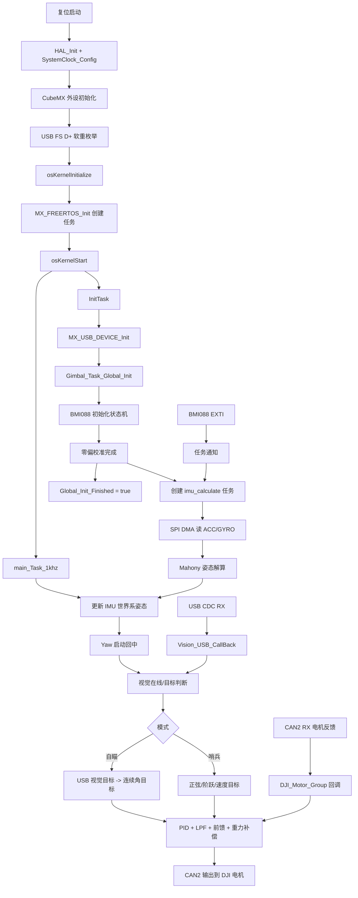

# 云台工程

基于 `STM32F405RGT6`、STM32 HAL、CubeMX、CMSIS-RTOS2/FreeRTOS 和 CMake 的双轴云台控制工程。当前代码以 C++ 业务层为主，CubeMX 继续负责外设初始化，`Usercode` 目录负责 BSP、模块和应用逻辑。

## 当前能力

- 双轴云台控制：Yaw/Pitch 两轴使用 DJI 6020 电机，当前应用层默认在 `CAN2` 上注册 Pitch 电机 ID 4、Yaw 电机 ID 2。
- 姿态解算：BMI088 通过 `SPI1 + DMA` 读取，初始化后创建 `imu_calculate` 任务，通过 Mahony 算法维护四元数 `q0/q1/q2/q3`。
- 启动回中：系统初始化完成后，Yaw 轴先回到机械目标角 `304 deg`，稳定后建立世界系 Yaw 零点，再进入自动模式。
- 视觉通信：USB CDC 接收视觉目标帧，在线且检测到目标时进入自瞄模式，否则进入哨兵扫描模式。
- 控制链路：角度环 -> 速度环 -> 电机输出，支持角度目标差分前馈、速度目标低通、Pitch 重力补偿和机械限位。
- 构建输出：CMake 生成 `.elf`，并通过自定义目标生成 `.hex`、`.bin`，同时打印固件 size。

## 系统流程


```mermaid
flowchart TD
    A[复位启动] --> B[HAL_Init + SystemClock_Config]
    B --> C[CubeMX 外设初始化]
    C --> D[USB FS D+ 软重枚举]
    D --> E[osKernelInitialize]
    E --> F[MX_FREERTOS_Init 创建任务]
    F --> G[osKernelStart]

    G --> H[InitTask]
    H --> I[MX_USB_DEVICE_Init]
    I --> J[Gimbal_Task_Global_Init]
    J --> K[BMI088 初始化状态机]
    K --> L[零偏校准完成]
    L --> M[创建 imu_calculate 任务]
    L --> N[Global_Init_Finished = true]

    G --> O[main_Task_1khz]
    O --> P[更新 IMU 世界系姿态]
    P --> Q[Yaw 启动回中]
    Q --> R[视觉在线/目标判断]
    R --> S{模式}
    S -->|自瞄| T[USB 视觉目标 -> 连续角目标]
    S -->|哨兵| U[正弦/阶跃/速度目标]
    T --> V[PID + LPF + 前馈 + 重力补偿]
    U --> V
    V --> W[CAN2 输出到 DJI 电机]

    X[BMI088 EXTI] --> Y[任务通知]
    Y --> M
    M --> Z[SPI DMA 读 ACC/GYRO]
    Z --> AA[Mahony 姿态解算]
    AA --> P

    AB[USB CDC RX] --> AC[Vision_USB_CallBack]
    AC --> R

    AD[CAN2 RX 电机反馈] --> AE[DJI_Motor_Group 回调]
    AE --> V
```

## 任务划分

| 任务 | 来源 | 周期/触发 | 职责 |
| --- | --- | --- | --- |
| `InitTask` | `Core/Src/freertos.c`，由 `Gimbal_Task.cpp` 重写弱符号 | 启动后循环，初始化完成后自删除 | 初始化 USB、串口、BMI088、视觉、电机、PID、滤波器，并推进 BMI088 初始化状态机 |
| `main_Task_1khz` | `Usercode/3_application/Gimbal_Task/Gimbal_Task.cpp` | `osDelayUntil`，1 ms | 云台主控制循环，处理回中、模式切换、目标生成、PID、电机输出和任务耗时统计 |
| `Data_ptintf` | `Gimbal_Task.cpp` | 5 ms | 自动模式准备好后，通过 USB 回传当前 Yaw/Pitch |
| `TimeCount` | `Gimbal_Task.cpp` | 1 ms | `Global_Init_Finished` 后递增 `Task_Time`，作为应用层毫秒时基 |
| `imu_calculate` | `Usercode/3_application/bmi088/app_bmi088.cpp` | BMI088 数据就绪通知 | 读取 ACC/GYRO 原始数据，执行 Mahony 姿态解算 |

## 控制逻辑

启动阶段：

1. `main.cpp` 初始化 GPIO、DMA、USART1、SPI1、USART6、CAN1、CAN2、UART5。
2. `USB_FS_ReEnumerate()` 临时拉低 `PA12`，让 USB CDC 重新枚举。
3. `InitTask` 调用 `Gimbal_Task_Global_Init()`，初始化 `Serial`、BMI088、`Vision`、DJI 电机、PID 和低通滤波器。
4. BMI088 完成 soft reset、ID 检查、寄存器配置和 800 个目标样本的零偏校准后，创建 `imu_calculate` 任务。
5. `Global_Init_Finished` 置位后，主任务开始 Yaw 启动回中。
6. Yaw 机械角回到 `304 deg`，并满足误差小于 `1 deg`、速度小于 `0.10 deg/s`、连续 200 帧稳定后，设置世界系 Yaw 零点。
7. 回中完成后等待 300 ms，同步视觉和 PID 目标，进入自动模式。

运行阶段：

- `gimbal_states_aim_mode`：视觉在线且 `Mode=1` 时启用。USB 目标角会按当前连续角展开，再限幅到当前圈数附近的 Yaw 范围和 Pitch 范围。
- `gimbal_states_sentry_mode`：视觉离线或未检测到目标时启用。默认使用 Yaw/Pitch 正弦扫描，也保留阶跃目标和速度目标模式。
- `is_lpf_mode` 为 `true` 时，角度环先生成速度目标，再经过低通滤波后进入速度环。
- `is_g_feedback_mode` 为 `true` 时，Pitch 输出叠加 `Pitch_Gravity_Compensation()`。
- `Need_Change_Mode` 置位时会重置 PID 和滤波器，避免模式切换瞬间目标突变导致输出跳变。

主要调参入口在 `Usercode/3_application/Gimbal_Task/Gimbal_Task.cpp`：

- `Control_Config_Data`：哨兵扫描幅值、周期、频率、阶跃目标等。
- `Gimbal_Yaw_Target_High/Low`、`Gimbal_Pitch_Target_High/Low`：目标角限幅。
- `Gimbal_Yaw_Mechanical_Zero`、`Gimbal_Pitch_Mechanical_Zero`：机械零位。
- `Gimbal_Yaw_Motor_PID_Init()`、`Gimbal_Pitch_Motor_PID_Init()`：两轴 PID、积分限幅、前馈、输出限幅。
- `is_gimbal_target_mode`、`is_lpf_mode`、`is_g_feedback_mode`、`is_feedforward_mode`：控制链路开关。

## USB 视觉协议

视觉通信通过 USB CDC，收发帧结构一致，当前代码使用 `#pragma pack(push, 1)` 固定为 11 字节。

| 字段 | 类型 | 说明 |
| --- | --- | --- |
| `Frame_Header` | `uint8_t` | 固定 `0xAA` |
| `Mode` | `uint8_t` | `1` 表示有目标，`0` 表示无目标 |
| `Yaw` | `float` | 视觉给出的 Yaw 目标角 |
| `Pitch` | `float` | 视觉给出的 Pitch 目标角 |
| `Frame_Tail` | `uint8_t` | 固定 `0x55` |

接收侧只在以下条件满足时处理数据：

- `Global_Init_Finished == true`
- `Gimbal_Vision_Ready == true`
- `Gimbal_Auto_Mode_Ready == true`
- 帧长度等于 11 字节
- 帧头为 `0xAA` 且帧尾为 `0x55`

视觉状态处理：

- `Mode 0 -> 1` 默认需要连续 3 帧确认。
- `Mode 1 -> 0` 默认需要连续 50 帧确认。
- 超过 100 ms 未收到有效帧，判定视觉离线。
- `Data_ptintf` 任务会把当前云台连续 Yaw/Pitch 以同样帧格式回传。

## 外设与硬件映射

| 外设 | 当前用途 | 主要配置 |
| --- | --- | --- |
| `CAN1` | 已初始化，预留 | 1 Mbps，PB8/PB9 |
| `CAN2` | DJI 电机反馈与控制 | 1 Mbps，PB5/PB6，当前云台电机组使用该总线 |
| `SPI1` | BMI088 | PA5/PA6/PA7，DMA，CubeMX 预分频 64 |
| `USB_OTG_FS` | USB CDC 视觉通信 | `PA12` 用于 D+，启动时做软重枚举 |
| `USART1` | 当前 `Serial_Printf` 默认输出 | 115200 8N1，DMA RX/TX，PA9/PB7 |
| `USART6` | 已初始化，预留 | 115200 8N1，DMA RX/TX，PC6/PC7 |
| `UART5` | 已初始化，预留 | 115200 8N1，PC12/PD2 |
| `DWT` | 运行时间统计 | 用于主任务周期和执行耗时测量 |

BMI088 当前初始化参数：

- ACC CS：`PC4`，低有效。
- GYRO CS：`PB1`，低有效。
- 初始化接口传入 ACC INT1 为 `PB0`，GYRO INT3 为 `PC5`。
- 当前 `HAL_GPIO_EXTI_Callback()` 对 `GPIO_PIN_5` 触发读取流程，调试硬件接线时需要和 `.ioc`、实际传感器中断脚保持一致。

## 目录结构

```text
.
├─ Core/
│  ├─ Inc/                         # CubeMX 生成头文件
│  └─ Src/                         # CubeMX 生成源码，包含 main.cpp 和 freertos.c
├─ USB_DEVICE/
│  ├─ App/                         # USB Device 应用接口，当前使用 usbd_cdc_if.cpp
│  └─ Target/                      # USB Device 底层配置
├─ Usercode/
│  ├─ 1_bsp/                       # 板级支持层
│  │  ├─ CAN/                      # CAN 过滤器、收发、回调分发
│  │  ├─ DWT/                      # DWT 周期计数
│  │  ├─ MyRTOS/                   # FreeRTOS 任务通知封装
│  │  ├─ SPI/                      # SPI DMA 发送/接收封装
│  │  ├─ USART/                    # UART DMA + idle 接收封装
│  │  └─ USB/                      # USB CDC 双缓冲和 printf 封装
│  ├─ 2_module/                    # 可复用模块层
│  │  ├─ Alg/                      # PID、MahonyAHRS、低通、前馈、数学工具
│  │  ├─ bmi088/                   # BMI088 寄存器级驱动
│  │  ├─ DJI_Motor/                # DJI 3508/6020 电机封装
│  │  ├─ DR16/                     # 遥控器解析模块，当前主流程未接入
│  │  └─ Serial/                   # 串口环形缓冲和 printf
│  └─ 3_application/               # 应用层
│     ├─ bmi088/                   # BMI088 初始化、校准、任务和姿态接口
│     ├─ Gimbal/                   # 云台坐标系、连续角和姿态矩阵模型
│     ├─ Gimbal_Task/              # 主控制任务、模式切换、PID 和目标生成
│     └─ Vision/                   # USB 视觉通信协议和在线检测
├─ cmake/
│  ├─ gcc-arm-none-eabi.cmake      # arm-none-eabi 工具链
│  └─ stm32cubemx/CMakeLists.txt   # CubeMX 生成源码列表
├─ CMakeLists.txt                  # 顶层构建入口
├─ CMakePresets.json               # Debug/Release 预设
├─ F405RGT6Project.ioc             # CubeMX 工程
├─ GeneratorBefore.bat             # CubeMX 生成前脚本
├─ GeneratorAfter.bat              # CubeMX 生成后脚本
├─ STM32F405XX_FLASH.ld            # 链接脚本
└─ Gimbal_Pitch_Yaw_Analysis.md    # 云台姿态链路分析笔记
```

## 关键文件

| 文件 | 作用 |
| --- | --- |
| `Core/Src/main.cpp` | HAL 初始化、外设初始化、USB 软重枚举、启动 RTOS |
| `Core/Src/freertos.c` | CubeMX 生成的任务定义和弱任务函数 |
| `Usercode/3_application/Gimbal_Task/Gimbal_Task.cpp` | 当前项目的核心控制逻辑 |
| `Usercode/3_application/Gimbal/Gimbal.cpp` | IMU 世界系姿态、连续角、坐标变换和云台模型 |
| `Usercode/3_application/Vision/Vision.cpp` | USB 视觉帧解析、去抖、在线检测、姿态回传 |
| `Usercode/3_application/bmi088/app_bmi088.cpp` | BMI088 初始化状态机、零偏校准、IMU 任务和 EXTI 触发 |
| `Usercode/2_module/bmi088/bmi088.cpp` | BMI088 SPI DMA 寄存器读写和原始数据读取 |
| `Usercode/2_module/DJI_Motor/DJI_Motor.cpp` | DJI 电机组注册、反馈解析、CAN 输出打包 |
| `Usercode/2_module/Alg/PID/PID.cpp` | 角度环、速度环、串级 PID、积分限制和目标差分前馈 |
| `Usercode/2_module/Alg/LowPassFilter/LowPassFilter.cpp` | 一阶低通滤波器 |
| `Usercode/2_module/Alg/FeedForward/FeedForward.cpp` | 摩擦前馈补偿函数 |
| `Usercode/1_bsp/CAN/bsp_can.c` | CAN filter、收发和 FIFO 回调注册 |
| `Usercode/1_bsp/SPI/bsp_spi.cpp` | SPI DMA 片选管理和完成回调 |
| `Usercode/1_bsp/USB/bsp_usb.cpp` | USB CDC 接收双缓冲、发送和 printf |
| `Usercode/1_bsp/USART/bsp_usart.cpp` | UART DMA 接收空闲中断、发送完成回调 |

## 构建

前置要求：

- CMake 3.22 或更高版本
- Ninja
- `arm-none-eabi-gcc/g++/objcopy/size` 在 `PATH` 中

Debug 构建：

```bash
cmake --preset Debug
cmake --build --preset Debug
```

Release 构建：

```bash
cmake --preset Release
cmake --build --preset Release
```

默认输出目录来自 `CMakePresets.json`：

```text
build-vscode/Debug/
build-vscode/Release/
```

主要产物：

```text
F405RGT6Project.elf
F405RGT6Project.hex
F405RGT6Project.bin
F405RGT6Project.map
```

顶层 `CMakeLists.txt` 已启用：

- C 标准：C11
- C++ 标准：C++17
- 目标架构：Cortex-M4F，hard-float
- `-fno-rtti`
- `-fno-exceptions`
- `-fno-threadsafe-statics`
- `--gc-sections`
- `-u _printf_float`

## CubeMX 与 C++ 协同

CubeMX 默认维护 `main.c` 和 `usbd_cdc_if.c`，但当前工程实际编译：

- `Core/Src/main.cpp`
- `USB_DEVICE/App/usbd_cdc_if.cpp`

协同方式：

1. CubeMX 生成前运行 `GeneratorBefore.bat`，把 `main.cpp` 临时改名为 `main.c`。
2. CubeMX 生成代码。
3. CubeMX 生成后运行 `GeneratorAfter.bat`，把 `main.c` 改回 `main.cpp`，并删除生成的 `USB_DEVICE/App/usbd_cdc_if.c`。
4. 重新执行 CMake configure 或 build。

顶层 `CMakeLists.txt` 会把 CubeMX 列表里的 `main.c` 和 `usbd_cdc_if.c` 标记为 `HEADER_FILE_ONLY`，再显式加入 `.cpp` 文件，避免 C/C++ 重复入口。

## 新增代码规则

- `Usercode/1_bsp` 和 `Usercode/2_module` 使用 `file(GLOB_RECURSE)` 自动收集 `.c/.cpp`。
- `Usercode/3_application` 使用手动 `APP_SOURCES` 列表，新增或删除应用层源码时必须同步维护 `Usercode/3_application/CMakeLists.txt`。
- 顶层 CMake 会自动收集 `Usercode` 下所有包含头文件的目录，通常可以直接 `#include "xxx.h"`。
- CubeMX 生成目录尽量只在 `USER CODE BEGIN/END` 区域内修改。
- 当前代码同时保留部分旧 C 风格接口和新的 `Class_*` C++ 封装，云台主流程优先使用 `Class_Gimbal`、`Class_DJI_Motor`、`Class_PID`、`Class_Vision`。
- `STM32_Printf` 默认走 `Serial_Printf`，需要走 USB 时可定义 `STM32_PRINTF_USE_USB=1`。

## 开发提示

- 改控制参数优先看 `Gimbal_Task.cpp`，尤其是 PID 初始化、机械零位、限位和模式开关。
- 改视觉协议优先看 `Vision.h/.cpp`，注意帧结构是 packed，PC 端必须按小端 float 发送。
- 改 BMI088 读写流程优先看 `app_bmi088.cpp` 和 `bmi088.cpp`，当前数据链路依赖 EXTI -> 任务通知 -> SPI DMA 回调。
- 改电机数量或 ID 时，优先改 `Gimbal_DJI_Motor_Init()`，并确认 `CAN2` 过滤器和发送 ID 覆盖目标电机。
- 仓库里部分历史中文注释可能存在编码不一致，新增 README 和源码建议统一保存为 UTF-8。
